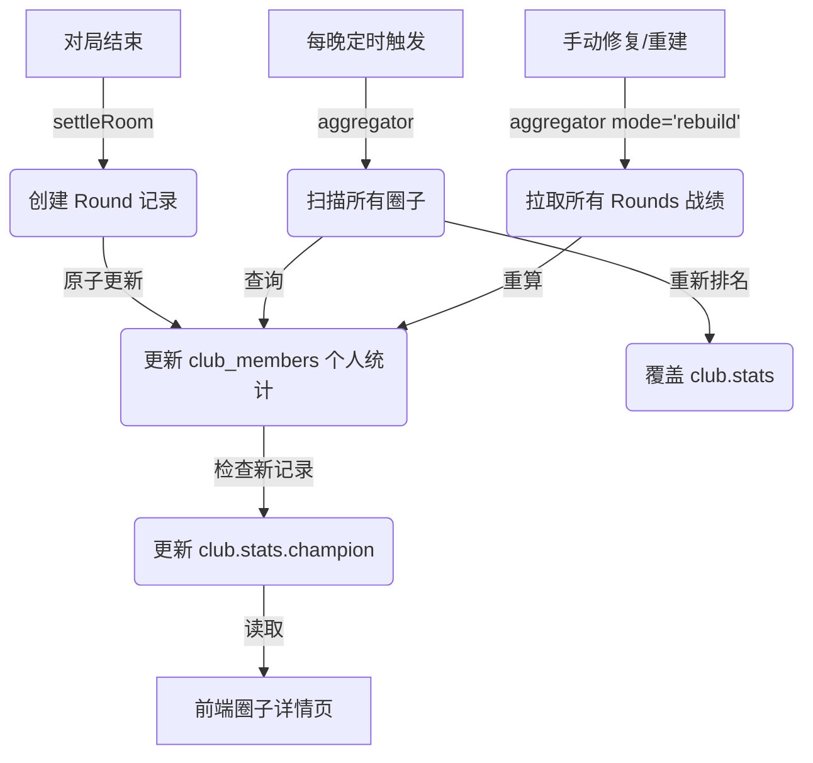

# ADR 004: 牌友圈统计系统架构复盘

## 状态
已接受 / 已实现

## 背景
应用需要在圈子详情页展示“总胜场冠军”和“常胜将军”统计数据。
早期的实现依赖于前端聚合（拉取所有成员并即时排序），存在复杂度为 O(N) 的性能瓶颈，随着圈子人数增长会导致卡顿。
同时，观察到数据不一致问题（例如：有对局记录，但数据库中胜场显示为 0）。

## 决策：写时聚合 (Write-Aggregated) 架构
即使在数据量尚小的情况下，我们决定从“读时计算 (Read-Many)”模式迁移到“写时聚合 (Write-Aggregated)”模式。

### 1. 核心模式
-   **写路径 (重计算)**：计算发生在数据写入或变更时：
    1.  **实时更新**：`settleRoom` 在结算时更新个人数据，并即时检查是否产生了新冠军。
    2.  **定期巡检**：`aggregator` 每晚运行，进行全量重新排名，修正由于并发或逻辑漏洞导致的数据漂移。
    3.  **按需重建**：`aggregator` 的 `rebuild` 模式可直接从原始 `rounds` 数据重建统计表。
-   **读路径 (极轻量)**：前端只需读取 `club.stats` 中的预计算字段。时间复杂度：O(1)。

### 2. 数据库设计 (Schema)

#### A. `rounds` (真理之源)
存储每一局游戏的原始分数数据。
```json
{
  "_id": "round_uuid",
  "roomDocId": "room_uuid",
  "clubId": "217531", // 数字 ID
  "scores": {
    "openid_A": 10,
    "openid_B": -10
  },
  "type": "game"
}
```

#### B. `club_members` (成员累计表)
存储每个成员的累计战绩。
```json
{
  "_id": "clubId_openId",
  "stats": {
    "gameCount": 10,
    "winCount": 5,
    "totalScore": 150,
    "winRate": 50 // 整数或浮点数
  }
}
```

#### C. `clubs.stats` (排行榜快照)
存储圈子层面的聚合元数据。
```json
{
  "stats": {
    "champion": {
      "name": "玩家 A",
      "wins": 5,
      "avatar": "..."
    },
    "bestPlayer": {
      "name": "玩家 B",
      "winRate": 60, // 至少 3 局
      "wins": 3
    },
    "lastAggregatedAt": "时间戳"
  }
}
```

### 3. 数据流向



## 权衡分析 (Trade-Off Analysis)

### 优势 (Pros)
1.  **高扩展性**：无论圈子有 100 人还是 10,000 人，前端加载速度恒定为 O(1)。
2.  **鲁棒性 (Resilience)**：采用“双流”机制（实时 + 定时），即使实时更新因网络或逻辑问题失败，每晚的巡检也会自动修复数据（Self-Healing）。
3.  **准确性**：`rebuild` 模式通过追溯原始战绩单 (`rounds`)，实现了可审计的数据准确性，修复了历史遗留的脏数据。

### 劣势 (Cons)
1.  **延迟**：“常胜将军”（胜率第一）主要依赖每晚更新（延迟一致性），而“冠军”通常是实时的。考虑到胜率排名的计算成本，这是可以接受的妥协。
2.  **写入复杂度**：`settleRoom` 函数的职责变重了，需要处理更多数据库操作。

## 影响 (Consequences)
-   前端代码大幅简化，删除了庞大的客户端计算逻辑。
-   即使数据库中 `room.scores` 字段缺失，现在的架构也能通过查询 `rounds` 集合正常工作。
-   **重要约束**：`rounds` 集合现在是单一可信数据源 (Source of Truth)，必须妥善保护。

## 依赖关系
-   **云函数**: `settleRoom`, `aggregator`
-   **SDK**: `wx-server-sdk`
-   **集合**: `active -> rooms`, `finished -> rounds`, `metadata -> clubs/members`

## 结论
该架构设计合理，符合移动端对低延迟读取的高要求，同时通过“终一致性”保证了数据的准确性。
